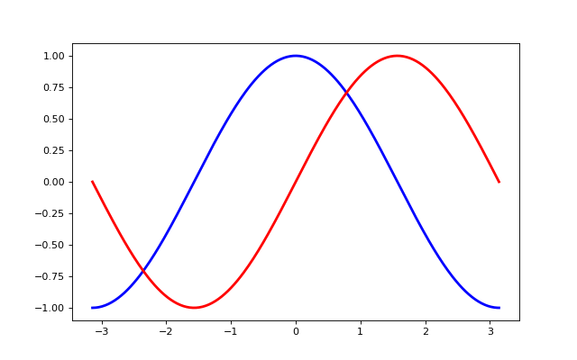

### 设置绘图区域

通过xlim和ylim设置坐标轴的边界

```python
xmin ,xmax = X.min(), X.max()
ymin, ymax = Y.min(), Y.max()

dx = (xmax - xmin) * 0.2
dy = (ymax - ymin) * 0.2

xlim(xmin - dx, xmax + dx)
ylim(ymin - dy, ymax + dy)
```

xlim和ylim可以用一条命令替代，axis。

例如，如下语句

```python
xlim(x1, x2)
ylim(y1, y2)
```

等价于

```python
axis([x1, x2, y1, y2])
```

[完整示例代码](exercice_4.py)

输出效果:


