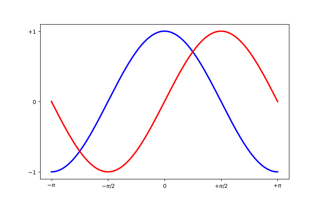

### 设置刻度标记的标签

当我们设置记号的时候，我们可以同时设置记号的标签。注意这里使用了 LaTeX。

```python
...
xticks([-np.pi, -np.pi/2, 0, np.pi/2, np.pi],
       [r'$-\pi$', r'$-\pi/2$', r'$0$', r'$+\pi/2$', r'$+\pi$'])

yticks([-1, 0, +1],
       [r'$-1$', r'$0$', r'$+1$'])
...
```

[完整示例代码](exercice_6.py)

输出效果:


