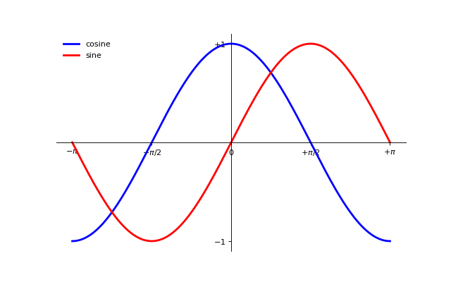

### 添加图例

我们在图的左上角添加一个图例。为此，我们只需要在 plot 函数里以「键 - 值」的形式增加一个参数。

```python
...
plot(X, C, color="blue", linewidth=2.5, linestyle="-", label="cosine")
plot(X, S, color="red",  linewidth=2.5, linestyle="-", label="sine")

legend(loc='upper left')
...
```

[完整示例代码](exercice_8.py)

输出效果:


