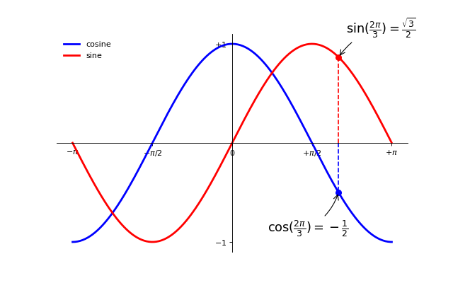

### 给一些特殊点做注释

我们希望在 2π/3 的位置给两条函数曲线加上一个注释。首先，我们在对应的函数图像位置上画一个点；然后，向横轴引一条垂线，以虚线标记；最后，写上标签。

```python
...

t = 2*np.pi/3
plot([t,t],[0,np.cos(t)], color ='blue', linewidth=2.5, linestyle="--")
scatter([t,],[np.cos(t),], 50, color ='blue')

annotate(r'$\sin(\frac{2\pi}{3})=\frac{\sqrt{3}}{2}$',
         xy=(t, np.sin(t)), xycoords='data',
         xytext=(+10, +30), textcoords='offset points', fontsize=16,
         arrowprops=dict(arrowstyle="->", connectionstyle="arc3,rad=.2"))

plot([t,t],[0,np.sin(t)], color ='red', linewidth=2.5, linestyle="--")
scatter([t,],[np.sin(t),], 50, color ='red')

annotate(r'$\cos(\frac{2\pi}{3})=-\frac{1}{2}$',
         xy=(t, np.cos(t)), xycoords='data',
         xytext=(-90, -50), textcoords='offset points', fontsize=16,
         arrowprops=dict(arrowstyle="->", connectionstyle="arc3,rad=.2"))
...
```

[完整示例代码](exercice_9.py)

输出效果:


