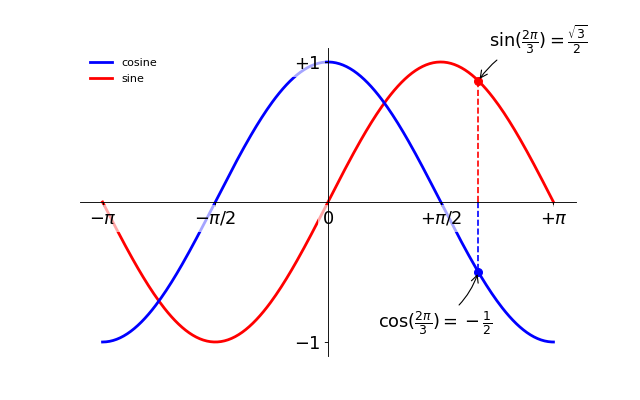

### 精益求精

坐标轴上的记号标签被曲线挡住了，作为强迫症患者（雾）这是不能忍的。我们可以把它们放大，然后添加一个白色的半透明底色。这样可以保证标签和曲线同时可见。

```python
...
for label in ax.get_xticklabels() + ax.get_yticklabels():
    label.set_fontsize(16)
    label.set_bbox(dict(facecolor='white', edgecolor='None', alpha=0.65 ))
...
```

[完整示例代码](exercice_10.py)

输出效果:


